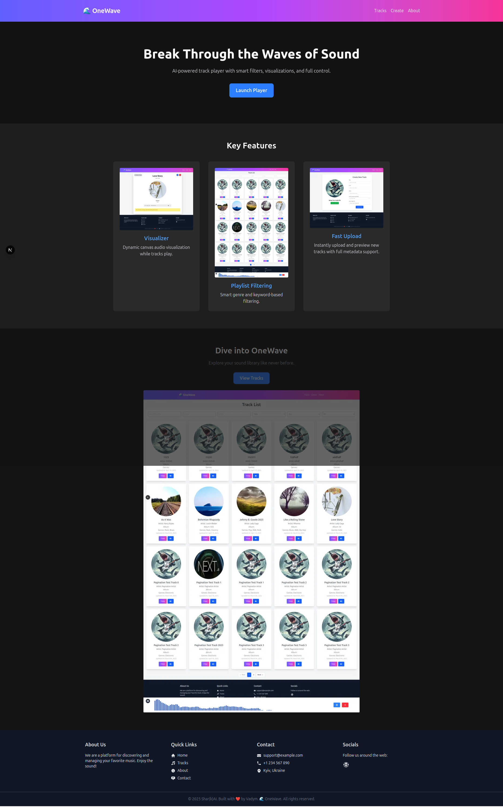

This is a [Next.js](https://nextjs.org) project bootstrapped with [`create-next-app`](https://nextjs.org/docs/app/api-reference/cli/create-next-app).



## Git HUB
https://github.com/SHAR-K-AI/DeepWave

## Getting Started

First, run the development server:

```bash

yarn go

```
This command starts two services:

API on http://localhost:3000

Frontend on http://localhost:3001

### Git HUB
```bash
npm fund
```
### Git HUB
```
sharkai-deepwave@0.1.0
├─┬ https://github.com/open-cli-tools/concurrently?sponsor=1
│ │ └── concurrently@9.1.2
│ ├─┬ https://github.com/chalk/chalk?sponsor=1
│ │ │ └── chalk@4.1.2
│ │ └── https://github.com/chalk/ansi-styles?sponsor=1
│ │     └── ansi-styles@4.3.0
│ ├── https://github.com/sponsors/ljharb
│ │   └── shell-quote@1.8.2, get-intrinsic@1.3.0, function-bind@1.1.2, gopd@1.2.0, has-symbols@1.1.0, has-tostringtag@1.0.2, resolve@2.0.0-next.5, array-includes@3.1.8, call-bind@1.0.8, define-data-property@1.1.4, has-property-descriptors@1.0.2, define-properties@1.2.1, es-abstract@1.23.9, array-buffer-byte-length@1.0.2, arraybuffer.prototype.slice@1.0.4, available-typed-arrays@1.0.7, call-bound@1.0.4, data-view-buffer@1.0.2, data-view-byte-offset@1.0.1, es-to-primitive@1.3.0, is-date-object@1.1.0, is-symbol@1.1.1, function.prototype.name@1.1.8, functions-have-names@1.2.3, get-symbol-description@1.1.0, globalthis@1.0.4, has-proto@1.2.0, is-array-buffer@3.0.5, is-callable@1.2.7, is-data-view@1.0.2, is-regex@1.2.1, is-shared-array-buffer@1.0.4, is-typed-array@1.1.15, is-weakref@1.1.1, object-inspect@1.13.4, object.assign@4.1.7, own-keys@1.0.1, regexp.prototype.flags@1.5.4, safe-array-concat@1.1.3, safe-push-apply@1.0.0, safe-regex-test@1.1.0, string.prototype.trim@1.2.10, string.prototype.trimstart@1.0.8, typed-array-byte-length@1.0.3, for-each@0.3.5, typed-array-byte-offset@1.0.4, reflect.getprototypeof@1.0.10, which-builtin-type@1.2.1, is-async-function@2.1.1, is-finalizationregistry@1.1.1, is-generator-function@1.1.0, which-boxed-primitive@1.1.1, is-bigint@1.1.0, has-bigints@1.1.0, is-boolean-object@1.2.2, is-number-object@1.1.1, which-collection@1.0.2, is-map@2.0.3, is-set@2.0.3, is-weakmap@2.0.2, is-weakset@2.0.4, typed-array-length@1.0.7, unbox-primitive@1.1.0, which-typed-array@1.1.19, side-channel@1.1.0, side-channel-list@1.0.0, side-channel-map@1.0.1, side-channel-weakmap@1.0.2, is-string@1.1.1, array.prototype.findlastindex@1.2.6, array.prototype.flat@1.3.3, array.prototype.flatmap@1.3.3, object.fromentries@2.0.8, object.values@1.2.1, string.prototype.trimend@1.0.9, minimist@1.2.8, array.prototype.findlast@1.2.5, string.prototype.matchall@4.0.12
│ ├── https://github.com/chalk/supports-color?sponsor=1
│ │   └── supports-color@8.1.1
│ └── https://github.com/chalk/wrap-ansi?sponsor=1
│     └── wrap-ansi@7.0.0
├── https://opencollective.com/react-hook-form
│   └── react-hook-form@7.55.0
├─┬ https://opencollective.com/eslint
│ │ └── @eslint/eslintrc@3.3.1, espree@10.3.0, eslint-visitor-keys@4.2.0, @eslint-community/eslint-utils@4.6.1, eslint-visitor-keys@3.4.3, eslint-scope@8.3.0
│ ├── https://github.com/sponsors/epoberezkin
│ │   └── ajv@6.12.6
│ └── https://github.com/sponsors/sindresorhus
│     └── globals@14.0.0, strip-json-comments@3.1.1, find-up@5.0.0, locate-path@6.0.0, p-locate@5.0.0, p-limit@3.1.0, yocto-queue@0.1.0, escape-string-regexp@4.0.0, import-fresh@3.3.1, parse-json@5.2.0, @alloc/quick-lru@5.2.0
├─┬ https://eslint.org/donate
│ │ └── eslint@9.24.0
│ └── https://github.com/sponsors/nzakas
│     └── @humanwhocodes/module-importer@1.0.1, @humanwhocodes/retry@0.3.1
├─┬ https://opencollective.com/postcss/
│ │ └── postcss@8.4.31
│ └── https://github.com/sponsors/ai
│     └── nanoid@3.3.11
├── https://github.com/sponsors/tannerlinsley
│   └── @tanstack/react-virtual@3.13.6, @tanstack/virtual-core@3.13.6
├── https://opencollective.com/react-spring/donate
│   └── @react-spring/core@9.7.5
├── https://opencollective.com/immer
│   └── immer@10.1.1
├── https://github.com/sponsors/RubenVerborgh
│   └── follow-redirects@1.15.9
├── https://opencollective.com/browserslist
│   └── caniuse-lite@1.0.30001714
├── https://opencollective.com/libvips
│   └── sharp@0.34.1, @img/sharp-libvips-linux-x64@1.1.0, @img/sharp-libvips-linuxmusl-x64@1.1.0, @img/sharp-linux-x64@0.34.1, @img/sharp-linuxmusl-x64@0.34.1
├── https://paulmillr.com/funding/
│   └── chokidar@4.0.3, readdirp@4.1.2
├─┬ https://opencollective.com/parcel
│ │ └── @parcel/watcher@2.5.1, @parcel/watcher-linux-x64-glibc@2.5.1, @parcel/watcher-linux-x64-musl@2.5.1, lightningcss@1.29.2, lightningcss-linux-x64-gnu@1.29.2, lightningcss-linux-x64-musl@1.29.2
│ └── https://github.com/sponsors/jonschlinkert
│     └── picomatch@2.3.1, picomatch@4.0.2
├── https://opencollective.com/typescript-eslint
│   └── @typescript-eslint/eslint-plugin@8.30.1, @typescript-eslint/scope-manager@8.30.1, @typescript-eslint/types@8.30.1, @typescript-eslint/type-utils@8.30.1, @typescript-eslint/typescript-estree@8.30.1, @typescript-eslint/utils@8.30.1, @typescript-eslint/visitor-keys@8.30.1, @typescript-eslint/parser@8.30.1
├─┬ https://opencollective.com/eslint-import-resolver-typescript
│ │ └── eslint-import-resolver-typescript@3.10.0
│ ├─┬ https://github.com/privatenumber/get-tsconfig?sponsor=1
│ │ │ └── get-tsconfig@4.10.0
│ │ └── https://github.com/privatenumber/resolve-pkg-maps?sponsor=1
│ │     └── resolve-pkg-maps@1.0.0
│ ├── https://github.com/sponsors/SuperchupuDev
│ │   └── tinyglobby@0.2.12
│ └── https://github.com/sponsors/JounQin
│     └── unrs-resolver@1.5.0
└── https://github.com/sponsors/feross
    └── run-parallel@1.2.0, queue-microtask@1.2.3
```